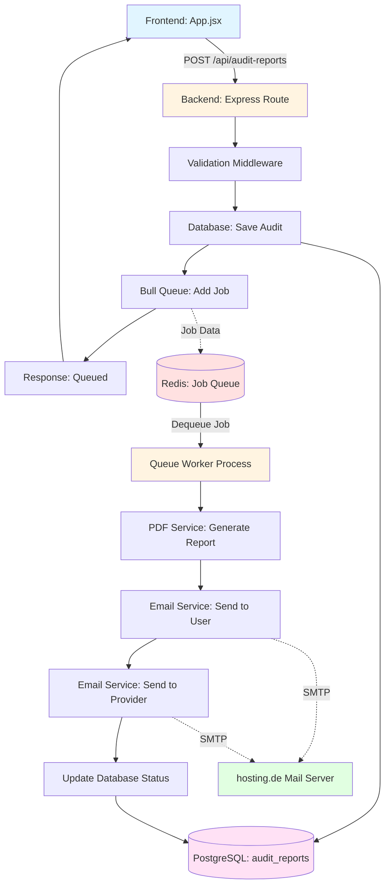
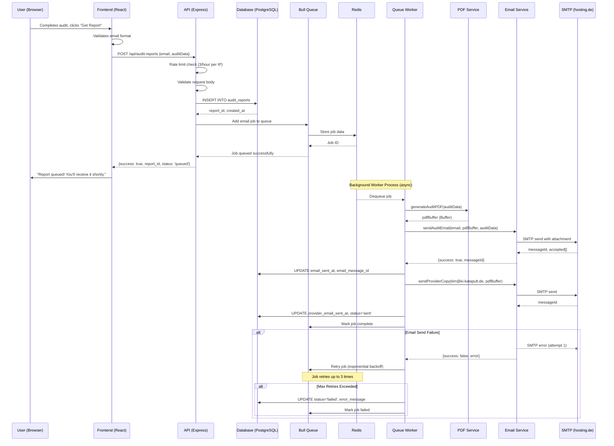

# feat: Email Service for Audit Reports

## Overview

Add email service functionality to send SaaSKiller audit report summaries to users and the provider (tim@ki-katapult.de). Users who complete an audit will receive a professionally formatted PDF report via email, and the provider will receive a copy for follow-up and lead tracking.

**Status:** ✨ Feature Enhancement
**Priority:** High
**Complexity:** Medium-High
**Estimated Effort:** 4-5 days (includes async queue infrastructure)

---

## Problem Statement / Motivation

### Current State
- Users complete audits but receive NO confirmation email
- Lead submission form exists but is **stubbed** (just shows an alert)
- POST `/api/leads` endpoint saves to database but **does not send any email**
- No PDF generation capability exists
- No email template system exists
- Provider (tim@ki-katapult.de) receives no notifications about new audit submissions

### User Pain Points
1. **No tangible deliverable**: Users invest time completing an audit but have nothing to reference later
2. **No confirmation**: Users unsure if their submission was successful
3. **No follow-up mechanism**: Provider has no efficient way to track and respond to leads

### Business Impact
- **Lost leads**: No email capture means no follow-up opportunity
- **Reduced trust**: Generic alert messages feel unprofessional
- **Missed conversions**: No PDF deliverable means no share-worthy content
- **Manual tracking burden**: Provider must manually query database to find new leads

### Why Email + PDF?
- **Professional delivery**: PDF report is tangible, shareable, and authoritative
- **Lead nurture**: Email allows follow-up sequences and relationship building
- **Dual notification**: User gets value, provider gets lead intelligence
- **Brand reinforcement**: Consistent email template reinforces SaaSKiller positioning
- **Data capture**: Email becomes verified contact point for future engagement

---

## Proposed Solution

### High-Level Approach

**Architecture:** Asynchronous queue-based email delivery (decoupled from HTTP request)

**Flow:**
```
User completes audit
  → Frontend submits email + audit data
    → Backend validates input
      → Save to database (audit_reports table)
        → Enqueue email job (Bull + Redis)
          → Return immediate success to frontend
            → Show "Report will be sent shortly" message

[Background Worker Process]
  → Dequeue email job
    → Generate PDF from audit data
      → Send email to user (with PDF attached)
        → Send copy to provider (tim@ki-katapult.de)
          → Update database status (sent/failed)
          → Retry on failure (3x with exponential backoff)
```

**Technology Stack:**
- **Email:** Nodemailer + hosting.de SMTP (existing service)
- **PDF Generation:** PDFKit (lightweight, programmatic - confirmed by user)
- **Templates:** Handlebars.js for email HTML
- **Job Queue:** Bull + Redis for async processing (Phase 1 MVP - user requirement)
- **Deployment:** Coolify environment variables for SMTP credentials
- **Queue Worker:** Separate process for background job processing

---

## Technical Approach

### Architecture

#### Component Diagram



#### Data Flow



### Database Schema

#### New Table: `audit_reports`

```sql
-- /home/tim/Desktop/saaskiller/api/migrations/create_audit_reports.sql

CREATE TABLE IF NOT EXISTS audit_reports (
  id UUID PRIMARY KEY DEFAULT gen_random_uuid(),

  -- User identification
  email VARCHAR(255) NOT NULL,

  -- Audit context
  tool_id INTEGER REFERENCES tools(id) ON DELETE SET NULL,
  tool_name VARCHAR(255) NOT NULL,
  tier_id INTEGER REFERENCES subscription_tiers(id) ON DELETE SET NULL,
  tier_name VARCHAR(100),

  -- Audit selections
  team_size INTEGER NOT NULL DEFAULT 1,
  features_kept JSONB NOT NULL DEFAULT '[]'::jsonb,
  features_removed JSONB NOT NULL DEFAULT '[]'::jsonb,
  custom_features JSONB NOT NULL DEFAULT '[]'::jsonb,

  -- Financial calculations
  bleed_amount NUMERIC(10,2) NOT NULL, -- 3-year cost
  build_cost_min NUMERIC(10,2) NOT NULL,
  build_cost_max NUMERIC(10,2) NOT NULL,
  savings_amount NUMERIC(10,2) NOT NULL,
  roi_months INTEGER,

  -- Email delivery tracking
  email_sent_at TIMESTAMP,
  email_message_id VARCHAR(255), -- Nodemailer messageId
  provider_email_sent_at TIMESTAMP,
  provider_message_id VARCHAR(255),
  status VARCHAR(50) NOT NULL DEFAULT 'pending', -- pending, sent, failed, bounced
  error_message TEXT,

  -- PDF metadata
  pdf_file_path TEXT, -- If storing PDFs on disk/S3
  pdf_size_bytes INTEGER,

  -- Timestamps
  created_at TIMESTAMP NOT NULL DEFAULT CURRENT_TIMESTAMP,
  updated_at TIMESTAMP DEFAULT CURRENT_TIMESTAMP,

  -- Indexes for common queries
  INDEX idx_audit_reports_email (email),
  INDEX idx_audit_reports_created_at (created_at DESC),
  INDEX idx_audit_reports_status (status),
  INDEX idx_audit_reports_tool_id (tool_id)
);

-- Trigger for updated_at
CREATE OR REPLACE FUNCTION update_audit_reports_updated_at()
RETURNS TRIGGER AS $$
BEGIN
  NEW.updated_at = CURRENT_TIMESTAMP;
  RETURN NEW;
END;
$$ LANGUAGE plpgsql;

CREATE TRIGGER audit_reports_updated_at
  BEFORE UPDATE ON audit_reports
  FOR EACH ROW
  EXECUTE FUNCTION update_audit_reports_updated_at();
```

#### Migration to Add to `/home/tim/Desktop/saaskiller/api/server.js`

```javascript
// Add after existing table creations (after subscription_tiers, around line 150)

// Create audit_reports table
await pool.query(`
  CREATE TABLE IF NOT EXISTS audit_reports (
    id UUID PRIMARY KEY DEFAULT gen_random_uuid(),
    email VARCHAR(255) NOT NULL,
    tool_id INTEGER REFERENCES tools(id) ON DELETE SET NULL,
    tool_name VARCHAR(255) NOT NULL,
    tier_id INTEGER REFERENCES subscription_tiers(id) ON DELETE SET NULL,
    tier_name VARCHAR(100),
    team_size INTEGER NOT NULL DEFAULT 1,
    features_kept JSONB NOT NULL DEFAULT '[]'::jsonb,
    features_removed JSONB NOT NULL DEFAULT '[]'::jsonb,
    custom_features JSONB NOT NULL DEFAULT '[]'::jsonb,
    bleed_amount NUMERIC(10,2) NOT NULL,
    build_cost_min NUMERIC(10,2) NOT NULL,
    build_cost_max NUMERIC(10,2) NOT NULL,
    savings_amount NUMERIC(10,2) NOT NULL,
    roi_months INTEGER,
    email_sent_at TIMESTAMP,
    email_message_id VARCHAR(255),
    provider_email_sent_at TIMESTAMP,
    provider_message_id VARCHAR(255),
    status VARCHAR(50) NOT NULL DEFAULT 'pending',
    error_message TEXT,
    pdf_file_path TEXT,
    pdf_size_bytes INTEGER,
    created_at TIMESTAMP NOT NULL DEFAULT CURRENT_TIMESTAMP,
    updated_at TIMESTAMP DEFAULT CURRENT_TIMESTAMP
  )
`);

// Create indexes
await pool.query(`
  CREATE INDEX IF NOT EXISTS idx_audit_reports_email ON audit_reports(email);
  CREATE INDEX IF NOT EXISTS idx_audit_reports_created_at ON audit_reports(created_at DESC);
  CREATE INDEX IF NOT EXISTS idx_audit_reports_status ON audit_reports(status);
`);
```

### File Structure

```
/home/tim/Desktop/saaskiller/api/
├── services/
│   ├── emailService.js         # Nodemailer transporter + send functions
│   ├── pdfService.js           # PDF generation with PDFKit
│   ├── auditReportService.js   # Business logic for audit reports
│   └── queueService.js         # Bull queue initialization
├── workers/
│   └── emailWorker.js          # Queue worker process for email jobs
├── templates/
│   └── emails/
│       ├── audit-report-user.hbs     # User email template
│       └── audit-report-provider.hbs # Provider email template
├── config/
│   ├── email.js                # SMTP configuration
│   └── redis.js                # Redis connection configuration
├── routes/
│   └── auditReports.js         # New route file
└── .env                        # Add SMTP and Redis variables

/home/tim/Desktop/saaskiller/src/
└── services/
    └── api.js                  # Add submitAuditReport function
```

### Implementation Plan

#### Phase 1: Foundation + Queue Infrastructure (Day 1-2)

**Step 1.1: Install Dependencies**
```bash
cd /home/tim/Desktop/saaskiller/api
npm install nodemailer@^6.9.0 pdfkit@^0.15.0 handlebars@^4.7.8 bull@^4.12.0 ioredis@^5.3.2
```

**Key Dependencies:**
- `nodemailer` - Email sending
- `pdfkit` - PDF generation
- `handlebars` - Email templating
- `bull` - Job queue management (NEW - Phase 1 requirement)
- `ioredis` - Redis client for Bull (NEW - Phase 1 requirement)

**Step 1.2: Environment Variables**

Update `/home/tim/Desktop/saaskiller/api/.env`:
```bash
# SMTP Configuration (hosting.de)
SMTP_HOST=mail.hosting.de
SMTP_PORT=587
SMTP_SECURE=false
SMTP_USER=your-email@yourdomain.com
SMTP_PASSWORD=your-smtp-password
SMTP_FROM_NAME=SaaSKiller
SMTP_FROM_EMAIL=noreply@yourdomain.com

# Provider notification
PROVIDER_EMAIL=tim@ki-katapult.de

# Optional: Connection pooling
SMTP_POOL=true
SMTP_MAX_CONNECTIONS=5

# Redis Configuration (NEW - Phase 1 requirement)
REDIS_HOST=localhost
REDIS_PORT=6379
REDIS_PASSWORD=
REDIS_DB=0

# Queue Configuration (NEW - Phase 1 requirement)
QUEUE_NAME=email-reports
QUEUE_ATTEMPTS=3
QUEUE_BACKOFF_DELAY=2000
```

**Step 1.3: Redis Setup in Coolify**

**Option A: Add Redis service in Coolify (Recommended)**
1. Add Redis service to your Coolify application
2. Set `REDIS_HOST` to the service name (e.g., `saaskiller-redis`)
3. Coolify will handle networking between containers

**CRITICAL - Enable Redis Persistence:**

Redis must persist data to disk to survive container restarts. Configure one of these persistence modes:

**Option 1: AOF (Append-Only File) - Recommended for queue reliability**
```bash
# Add to Redis container configuration in Coolify
appendonly yes
appendfsync everysec  # Sync to disk every second
```

**Option 2: RDB (Snapshotting)**
```bash
# Add to Redis container configuration
save 900 1      # Save if 1 key changed in 15 minutes
save 300 10     # Save if 10 keys changed in 5 minutes
save 60 10000   # Save if 10000 keys changed in 1 minute
```

**Recommended Configuration (Hybrid - Best of Both):**
```bash
# Enable both AOF and RDB for maximum durability
appendonly yes
appendfsync everysec
save 900 1
save 300 10
save 60 10000
```

**Volume Mount:**
Ensure Coolify mounts a persistent volume for Redis data directory:
- Mount path: `/data` (Redis default)
- This prevents data loss on container restart

**Option B: Use external Redis instance**
1. Configure `REDIS_HOST` to point to external Redis server
2. Ensure network connectivity from Coolify
3. Verify persistence is enabled on external instance

**Step 1.4: Create Database Migration**

Add to `/home/tim/Desktop/saaskiller/api/server.js` after existing table setup (around line 150).

**Step 1.5: Redis Configuration**

Create `/home/tim/Desktop/saaskiller/api/config/redis.js`:
```javascript
import Redis from 'ioredis';
import dotenv from 'dotenv';

dotenv.config();

// Create Redis client for Bull
const redisConfig = {
  host: process.env.REDIS_HOST || 'localhost',
  port: parseInt(process.env.REDIS_PORT || '6379'),
  password: process.env.REDIS_PASSWORD || undefined,
  db: parseInt(process.env.REDIS_DB || '0'),
  maxRetriesPerRequest: null, // Required for Bull
  enableReadyCheck: false
};

// Log connection attempt
console.log(`📡 Connecting to Redis at ${redisConfig.host}:${redisConfig.port}`);

const redis = new Redis(redisConfig);

redis.on('connect', () => {
  console.log('✅ Redis connected');
});

redis.on('error', (error) => {
  console.error('❌ Redis connection error:', error.message);
});

export default redisConfig;
```

**Step 1.6: Queue Service Configuration**

Create `/home/tim/Desktop/saaskiller/api/services/queueService.js`:
```javascript
import Queue from 'bull';
import redisConfig from '../config/redis.js';
import dotenv from 'dotenv';

dotenv.config();

// Create email reports queue
export const emailQueue = new Queue(
  process.env.QUEUE_NAME || 'email-reports',
  {
    redis: redisConfig,
    defaultJobOptions: {
      attempts: parseInt(process.env.QUEUE_ATTEMPTS || '3'),
      backoff: {
        type: 'exponential',
        delay: parseInt(process.env.QUEUE_BACKOFF_DELAY || '2000')
      },
      removeOnComplete: true,
      removeOnFail: false
    }
  }
);

// Queue event handlers
emailQueue.on('error', (error) => {
  console.error('❌ Queue error:', error);
});

emailQueue.on('waiting', (jobId) => {
  console.log(`⏳ Job ${jobId} is waiting`);
});

emailQueue.on('active', (job) => {
  console.log(`▶️  Job ${job.id} is now active`);
});

emailQueue.on('completed', (job, result) => {
  console.log(`✅ Job ${job.id} completed:`, result);
});

emailQueue.on('failed', (job, error) => {
  console.error(`❌ Job ${job.id} failed:`, error.message);
});

// Graceful shutdown
process.on('SIGTERM', async () => {
  console.log('📴 Closing email queue...');
  await emailQueue.close();
});

export default emailQueue;
```

**Step 1.7: Email Service Configuration**

Create `/home/tim/Desktop/saaskiller/api/config/email.js`:
```javascript
import nodemailer from 'nodemailer';
import dotenv from 'dotenv';

dotenv.config();

// Validate required environment variables
const required = ['SMTP_HOST', 'SMTP_USER', 'SMTP_PASSWORD', 'SMTP_FROM_EMAIL'];
const missing = required.filter(key => !process.env[key]);

if (missing.length > 0) {
  console.error('❌ Missing required SMTP environment variables:', missing);
  process.exit(1);
}

// Create reusable transporter
const transporter = nodemailer.createTransport({
  pool: process.env.SMTP_POOL === 'true',
  host: process.env.SMTP_HOST,
  port: parseInt(process.env.SMTP_PORT || '587'),
  secure: process.env.SMTP_SECURE === 'true',
  auth: {
    user: process.env.SMTP_USER,
    pass: process.env.SMTP_PASSWORD
  },
  maxConnections: parseInt(process.env.SMTP_MAX_CONNECTIONS || '5'),
  maxMessages: 100
});

// Verify connection on startup
transporter.verify((error, success) => {
  if (error) {
    console.error('❌ SMTP connection failed:', error.message);
  } else {
    console.log('✅ SMTP server ready to send emails');
  }
});

export default transporter;
```

#### Phase 2: Queue Worker + PDF Generation (Day 2-3)

**Step 2.1: Queue Worker Implementation**

Create `/home/tim/Desktop/saaskiller/api/workers/emailWorker.js`:
```javascript
import { emailQueue } from '../services/queueService.js';
import pool from '../db.js';
import { generateAuditReportPDF } from '../services/pdfService.js';
import { sendAuditReportToUser, sendAuditReportToProvider } from '../services/emailService.js';

/**
 * Process email job from queue
 */
emailQueue.process(async (job) => {
  const { reportId, email, auditData } = job.data;

  console.log(`📧 Processing email job for report ${reportId}`);

  try {
    // Step 1: Generate PDF
    console.log(`📄 Generating PDF for ${auditData.toolName}...`);
    const pdfBuffer = await generateAuditReportPDF(auditData);
    const pdfSizeKB = (pdfBuffer.length / 1024).toFixed(2);
    console.log(`✅ PDF generated: ${pdfSizeKB} KB`);

    // Step 2: Send email to user
    console.log(`📨 Sending email to ${email}...`);
    const userEmailResult = await sendAuditReportToUser(email, auditData, pdfBuffer);
    console.log(`✅ User email sent: ${userEmailResult.messageId}`);

    // Step 3: Update database with user email status
    await pool.query(`
      UPDATE audit_reports
      SET email_sent_at = NOW(),
          email_message_id = $1,
          status = 'sent',
          pdf_size_bytes = $2
      WHERE id = $3
    `, [userEmailResult.messageId, pdfBuffer.length, reportId]);

    // Step 4: Send copy to provider (non-blocking failure)
    try {
      console.log(`📨 Sending provider copy to ${process.env.PROVIDER_EMAIL}...`);
      const providerResult = await sendAuditReportToProvider(email, auditData, pdfBuffer);
      console.log(`✅ Provider email sent: ${providerResult.messageId}`);

      await pool.query(`
        UPDATE audit_reports
        SET provider_email_sent_at = NOW(),
            provider_message_id = $1
        WHERE id = $2
      `, [providerResult.messageId, reportId]);
    } catch (providerError) {
      console.error(`⚠️ Provider email failed (non-critical):`, providerError.message);
      // Don't fail the job if provider email fails
    }

    return {
      success: true,
      reportId,
      userMessageId: userEmailResult.messageId,
      pdfSize: `${pdfSizeKB} KB`
    };

  } catch (error) {
    console.error(`❌ Email job failed for report ${reportId}:`, error);

    // Update database with failed status
    await pool.query(`
      UPDATE audit_reports
      SET status = 'failed',
          error_message = $1
      WHERE id = $2
    `, [error.message, reportId]);

    // Throw error to trigger Bull retry
    throw error;
  }
});

console.log('🔄 Email worker started and listening for jobs...');

// Graceful shutdown
process.on('SIGTERM', async () => {
  console.log('📴 Shutting down email worker...');
  await emailQueue.close();
  process.exit(0);
});
```

**Step 2.2: Worker Process Startup Script**

Add to `/home/tim/Desktop/saaskiller/package.json`:
```json
{
  "scripts": {
    "worker": "node api/workers/emailWorker.js",
    "dev:worker": "nodemon api/workers/emailWorker.js"
  }
}
```

**Step 2.3: Coolify Worker Service Configuration**

In Coolify, add a **separate service** for the queue worker:
1. Service name: `saaskiller-worker`
2. Start command: `npm run worker`
3. Environment variables: Same as API service (SMTP, Redis, etc.)
4. Scaling: 1 instance (can scale horizontally if needed)

**Step 2.4: PDF Service**

**Design Constraints (User Requirement):**

PDFKit is programmatic and requires manual positioning - NOT a design tool. The PDF output should be:

✅ **Invoice-style** (clean, simple, text-heavy)
- Simple text layout with clear hierarchy
- Minimal graphics (logo, dividers only)
- Table-based data presentation
- Black text on white background
- Professional business document aesthetic

❌ **NOT Brochure-style** (avoid complex layouts)
- No multi-column layouts
- No complex graphics or illustrations
- No background images or gradients
- No advanced typography (stick to standard fonts)

**Rationale:** PDFKit excels at document generation (invoices, receipts, reports) but is not designed for marketing materials. Keeping it simple saves dev time and ensures consistent output.

Create `/home/tim/Desktop/saaskiller/api/services/pdfService.js`:
```javascript
import PDFDocument from 'pdfkit';

/**
 * Generate audit report PDF (Invoice-style layout)
 * @param {Object} auditData - Audit report data from frontend
 * @returns {Promise<Buffer>} - PDF buffer
 */
export async function generateAuditReportPDF(auditData) {
  return new Promise((resolve, reject) => {
    const chunks = [];
    const doc = new PDFDocument({
      size: 'A4',
      margin: 50,
      info: {
        Title: `SaaSKiller Audit Report - ${auditData.toolName}`,
        Author: 'SaaSKiller',
        Subject: 'SaaS Cost Analysis & Build Estimate',
        Keywords: 'saas, audit, cost-analysis'
      }
    });

    // Collect PDF chunks in memory
    doc.on('data', chunk => chunks.push(chunk));
    doc.on('end', () => resolve(Buffer.concat(chunks)));
    doc.on('error', reject);

    // Header - Brand
    doc.fontSize(24)
       .fillColor('#1EA897') // brand-secondary color
       .text('SaaSKiller', { align: 'center' });

    doc.fontSize(14)
       .fillColor('#666')
       .text('Audit Report', { align: 'center' });

    doc.moveDown();
    doc.moveTo(50, doc.y).lineTo(545, doc.y).stroke('#E5E7EB');
    doc.moveDown();

    // Tool Information
    doc.fontSize(18)
       .fillColor('#333')
       .text(`${auditData.toolName} Analysis`);

    doc.moveDown(0.5);
    doc.fontSize(10)
       .fillColor('#666')
       .text(`Generated: ${new Date().toLocaleDateString('en-US', {
         year: 'numeric',
         month: 'long',
         day: 'numeric'
       })}`);

    doc.moveDown();

    // Current Tier
    if (auditData.tierName) {
      doc.fontSize(12)
         .fillColor('#333')
         .text(`Current Tier: ${auditData.tierName}`, { continued: false });
      doc.moveDown(0.3);
    }

    doc.fontSize(12)
       .text(`Team Size: ${auditData.teamSize} users`);
    doc.moveDown();

    // Financial Summary Box
    const boxTop = doc.y;
    doc.rect(50, boxTop, 495, 120)
       .fillAndStroke('#FEF2F2', '#DC2626');

    doc.fontSize(10)
       .fillColor('#666')
       .text('3-Year SaaS Bleed', 60, boxTop + 15);

    doc.fontSize(32)
       .fillColor('#DC2626')
       .text(`$${auditData.bleedAmount.toLocaleString()}`, 60, boxTop + 35);

    doc.fontSize(10)
       .fillColor('#666')
       .text('Build Cost Range', 60, boxTop + 75);

    doc.fontSize(16)
       .fillColor('#059669')
       .text(
         `$${auditData.buildCostMin.toLocaleString()} - $${auditData.buildCostMax.toLocaleString()}`,
         60,
         boxTop + 90
       );

    doc.y = boxTop + 130;
    doc.moveDown();

    // Savings
    doc.fontSize(14)
       .fillColor('#059669')
       .text(`💰 Potential Savings: $${auditData.savingsAmount.toLocaleString()}`, { align: 'center' });

    if (auditData.roiMonths) {
      doc.fontSize(10)
         .fillColor('#666')
         .text(`ROI in ${auditData.roiMonths} months`, { align: 'center' });
    }

    doc.moveDown(2);

    // Features Section
    doc.fontSize(14)
       .fillColor('#333')
       .text('Feature Analysis');

    doc.moveDown(0.5);

    // Core Features Kept
    if (auditData.featuresKept && auditData.featuresKept.length > 0) {
      doc.fontSize(12)
         .fillColor('#059669')
         .text(`✓ Core Features Kept (${auditData.featuresKept.length})`);

      auditData.featuresKept.forEach(feature => {
        doc.fontSize(10)
           .fillColor('#666')
           .text(`  • ${feature.name || feature}`, { indent: 10 });
      });
      doc.moveDown(0.5);
    }

    // Features Removed
    if (auditData.featuresRemoved && auditData.featuresRemoved.length > 0) {
      doc.fontSize(12)
         .fillColor('#DC2626')
         .text(`✗ Features Removed (${auditData.featuresRemoved.length})`);

      auditData.featuresRemoved.forEach(feature => {
        doc.fontSize(10)
           .fillColor('#666')
           .text(`  • ${feature.name || feature}`, { indent: 10 });
      });
      doc.moveDown(0.5);
    }

    // Custom Features
    if (auditData.customFeatures && auditData.customFeatures.length > 0) {
      doc.fontSize(12)
         .fillColor('#1EA897')
         .text(`+ Custom Features (${auditData.customFeatures.length})`);

      auditData.customFeatures.forEach(feature => {
        doc.fontSize(10)
           .fillColor('#666')
           .text(`  • ${feature.name}`, { indent: 10 });

        if (feature.estimated_hours) {
          doc.fontSize(9)
             .fillColor('#999')
             .text(`    Estimate: ${feature.estimated_hours} hours`, { indent: 15 });
        }
      });
    }

    // Footer
    doc.fontSize(8)
       .fillColor('#999')
       .text(
         'Stop Renting. Start Owning. | SaaSKiller.com',
         50,
         doc.page.height - 50,
         { align: 'center' }
       );

    doc.end();
  });
}
```

#### Phase 3: Email Templates (Day 1-2)

**Step 3.1: User Email Template**

Create `/home/tim/Desktop/saaskiller/api/templates/emails/audit-report-user.hbs`:
```handlebars
<!DOCTYPE html>
<html lang="en">
<head>
  <meta charset="UTF-8">
  <meta name="viewport" content="width=device-width, initial-scale=1.0">
  <title>Your SaaSKiller Audit Report</title>
</head>
<body style="margin: 0; padding: 0; font-family: -apple-system, BlinkMacSystemFont, 'Segoe UI', Roboto, sans-serif; background-color: #f4f4f4;">
  <table role="presentation" cellspacing="0" cellpadding="0" border="0" width="100%">
    <tr>
      <td style="padding: 20px 0;">
        <table role="presentation" cellspacing="0" cellpadding="0" border="0" width="600" style="margin: 0 auto; background-color: #ffffff; border-radius: 8px; overflow: hidden;">

          <!-- Header -->
          <tr>
            <td style="background: linear-gradient(135deg, #1EA897 0%, #0F766E 100%); padding: 40px 30px; text-align: center;">
              <h1 style="margin: 0; color: #ffffff; font-size: 28px; font-weight: bold;">
                Your Audit Report is Ready
              </h1>
              <p style="margin: 10px 0 0; color: #D1FAE5; font-size: 14px;">
                Stop Renting. Start Owning.
              </p>
            </td>
          </tr>

          <!-- Content -->
          <tr>
            <td style="padding: 40px 30px;">
              <p style="margin: 0 0 20px; color: #374151; font-size: 16px; line-height: 1.6;">
                Thank you for completing your <strong>{{toolName}}</strong> audit!
              </p>

              <!-- Financial Summary -->
              <table role="presentation" cellspacing="0" cellpadding="0" border="0" width="100%" style="margin: 20px 0; background-color: #FEF2F2; border-radius: 6px; border: 2px solid #DC2626;">
                <tr>
                  <td style="padding: 20px;">
                    <h2 style="margin: 0 0 10px; color: #DC2626; font-size: 18px;">
                      3-Year SaaS Bleed
                    </h2>
                    <p style="margin: 0; color: #DC2626; font-size: 36px; font-weight: bold;">
                      ${{bleedAmount}}
                    </p>
                    <p style="margin: 15px 0 0; color: #6B7280; font-size: 14px;">
                      Money gone forever if you keep renting {{toolName}}.
                    </p>
                  </td>
                </tr>
              </table>

              <!-- Build Cost -->
              <table role="presentation" cellspacing="0" cellpadding="0" border="0" width="100%" style="margin: 20px 0; background-color: #ECFDF5; border-radius: 6px; border: 2px solid #059669;">
                <tr>
                  <td style="padding: 20px;">
                    <h2 style="margin: 0 0 10px; color: #059669; font-size: 18px;">
                      Custom Build Estimate
                    </h2>
                    <p style="margin: 0; color: #059669; font-size: 28px; font-weight: bold;">
                      ${{buildCostMin}} - ${{buildCostMax}}
                    </p>
                    <p style="margin: 15px 0 0; color: #6B7280; font-size: 14px;">
                      One-time investment to own your software forever.
                    </p>
                  </td>
                </tr>
              </table>

              <!-- Savings -->
              <div style="text-align: center; margin: 30px 0; padding: 20px; background-color: #FEF3C7; border-radius: 6px;">
                <p style="margin: 0 0 5px; color: #92400E; font-size: 14px; font-weight: 600; text-transform: uppercase; letter-spacing: 1px;">
                  Potential Savings
                </p>
                <p style="margin: 0; color: #92400E; font-size: 32px; font-weight: bold;">
                  ${{savingsAmount}}
                </p>
              </div>

              <!-- Download PDF -->
              <div style="text-align: center; margin: 30px 0;">
                <p style="margin: 0 0 15px; color: #6B7280; font-size: 14px;">
                  Your complete audit report is attached as a PDF.
                </p>
              </div>

              <!-- CTA -->
              <div style="text-align: center; margin: 30px 0;">
                <a href="https://saaskiller.com/contact" style="display: inline-block; padding: 14px 32px; background-color: #1EA897; color: #ffffff; text-decoration: none; border-radius: 6px; font-weight: 600; font-size: 16px;">
                  Get Your Custom Quote
                </a>
              </div>

              <p style="margin: 30px 0 0; color: #6B7280; font-size: 14px; line-height: 1.6;">
                Questions? Reply to this email or visit <a href="https://saaskiller.com" style="color: #1EA897; text-decoration: none;">SaaSKiller.com</a>
              </p>
            </td>
          </tr>

          <!-- Footer -->
          <tr>
            <td style="padding: 20px 30px; background-color: #F9FAFB; border-top: 1px solid #E5E7EB;">
              <p style="margin: 0; color: #9CA3AF; font-size: 12px; text-align: center;">
                &copy; 2025 SaaSKiller. Stop Renting. Start Owning.
              </p>
            </td>
          </tr>
        </table>
      </td>
    </tr>
  </table>
</body>
</html>
```

**Step 3.2: Provider Email Template**

Create `/home/tim/Desktop/saaskiller/api/templates/emails/audit-report-provider.hbs`:
```handlebars
<!DOCTYPE html>
<html lang="en">
<head>
  <meta charset="UTF-8">
  <meta name="viewport" content="width=device-width, initial-scale=1.0">
  <title>New Audit Submission</title>
</head>
<body style="margin: 0; padding: 0; font-family: -apple-system, BlinkMacSystemFont, 'Segoe UI', Roboto, sans-serif; background-color: #f4f4f4;">
  <table role="presentation" cellspacing="0" cellpadding="0" border="0" width="100%">
    <tr>
      <td style="padding: 20px 0;">
        <table role="presentation" cellspacing="0" cellpadding="0" border="0" width="600" style="margin: 0 auto; background-color: #ffffff; border-radius: 8px;">

          <tr>
            <td style="padding: 30px;">
              <h1 style="margin: 0 0 20px; color: #111827; font-size: 20px;">
                🎯 New Audit Submission
              </h1>

              <table role="presentation" cellspacing="0" cellpadding="0" border="0" width="100%" style="margin: 20px 0;">
                <tr>
                  <td style="padding: 10px 0; border-bottom: 1px solid #E5E7EB;">
                    <strong style="color: #374151;">User Email:</strong>
                    <span style="color: #6B7280;">{{userEmail}}</span>
                  </td>
                </tr>
                <tr>
                  <td style="padding: 10px 0; border-bottom: 1px solid #E5E7EB;">
                    <strong style="color: #374151;">Tool:</strong>
                    <span style="color: #6B7280;">{{toolName}}</span>
                  </td>
                </tr>
                <tr>
                  <td style="padding: 10px 0; border-bottom: 1px solid #E5E7EB;">
                    <strong style="color: #374151;">Team Size:</strong>
                    <span style="color: #6B7280;">{{teamSize}} users</span>
                  </td>
                </tr>
                <tr>
                  <td style="padding: 10px 0; border-bottom: 1px solid #E5E7EB;">
                    <strong style="color: #374151;">3-Year Bleed:</strong>
                    <span style="color: #DC2626; font-weight: 600;">${{bleedAmount}}</span>
                  </td>
                </tr>
                <tr>
                  <td style="padding: 10px 0; border-bottom: 1px solid #E5E7EB;">
                    <strong style="color: #374151;">Build Estimate:</strong>
                    <span style="color: #059669; font-weight: 600;">${{buildCostMin}} - ${{buildCostMax}}</span>
                  </td>
                </tr>
                <tr>
                  <td style="padding: 10px 0; border-bottom: 1px solid #E5E7EB;">
                    <strong style="color: #374151;">Potential Savings:</strong>
                    <span style="color: #059669; font-weight: 600; font-size: 18px;">${{savingsAmount}}</span>
                  </td>
                </tr>
                <tr>
                  <td style="padding: 10px 0;">
                    <strong style="color: #374151;">Submitted:</strong>
                    <span style="color: #6B7280;">{{timestamp}}</span>
                  </td>
                </tr>
              </table>

              <p style="margin: 20px 0 0; color: #6B7280; font-size: 14px;">
                The complete audit report PDF is attached.
              </p>
            </td>
          </tr>
        </table>
      </td>
    </tr>
  </table>
</body>
</html>
```

#### Phase 4: Email Service (Day 2)

**Step 4.1: Email Service Module**

Create `/home/tim/Desktop/saaskiller/api/services/emailService.js`:
```javascript
import transporter from '../config/email.js';
import Handlebars from 'handlebars';
import fs from 'fs/promises';
import path from 'path';
import { fileURLToPath } from 'url';

const __filename = fileURLToPath(import.meta.url);
const __dirname = path.dirname(__filename);

/**
 * Render Handlebars email template
 */
async function renderEmailTemplate(templateName, data) {
  const templatePath = path.join(__dirname, '../templates/emails', `${templateName}.hbs`);
  const templateSource = await fs.readFile(templatePath, 'utf-8');
  const template = Handlebars.compile(templateSource);
  return template(data);
}

/**
 * Send audit report email to user
 */
export async function sendAuditReportToUser(userEmail, auditData, pdfBuffer) {
  const html = await renderEmailTemplate('audit-report-user', {
    toolName: auditData.toolName,
    bleedAmount: auditData.bleedAmount.toLocaleString(),
    buildCostMin: auditData.buildCostMin.toLocaleString(),
    buildCostMax: auditData.buildCostMax.toLocaleString(),
    savingsAmount: auditData.savingsAmount.toLocaleString()
  });

  const mailOptions = {
    from: `"${process.env.SMTP_FROM_NAME}" <${process.env.SMTP_FROM_EMAIL}>`,
    to: userEmail,
    subject: `Your ${auditData.toolName} Audit Report - Save $${auditData.savingsAmount.toLocaleString()}`,
    text: `Your SaaSKiller audit report for ${auditData.toolName} is ready. You could save $${auditData.savingsAmount.toLocaleString()} by owning your software instead of renting.`,
    html,
    attachments: [{
      filename: `saaskiller-audit-${auditData.toolName.toLowerCase().replace(/\s+/g, '-')}.pdf`,
      content: pdfBuffer,
      contentType: 'application/pdf'
    }]
  };

  try {
    const info = await transporter.sendMail(mailOptions);
    console.log('✅ User email sent:', info.messageId);
    return {
      success: true,
      messageId: info.messageId,
      accepted: info.accepted,
      rejected: info.rejected
    };
  } catch (error) {
    console.error('❌ User email failed:', error);
    throw new Error(`Failed to send email: ${error.message}`);
  }
}

/**
 * Send audit report copy to provider
 */
export async function sendAuditReportToProvider(userEmail, auditData, pdfBuffer) {
  const html = await renderEmailTemplate('audit-report-provider', {
    userEmail,
    toolName: auditData.toolName,
    teamSize: auditData.teamSize,
    bleedAmount: auditData.bleedAmount.toLocaleString(),
    buildCostMin: auditData.buildCostMin.toLocaleString(),
    buildCostMax: auditData.buildCostMax.toLocaleString(),
    savingsAmount: auditData.savingsAmount.toLocaleString(),
    timestamp: new Date().toLocaleString('en-US', {
      year: 'numeric',
      month: 'long',
      day: 'numeric',
      hour: '2-digit',
      minute: '2-digit',
      timeZoneName: 'short'
    })
  });

  const mailOptions = {
    from: `"${process.env.SMTP_FROM_NAME}" <${process.env.SMTP_FROM_EMAIL}>`,
    to: process.env.PROVIDER_EMAIL,
    subject: `New Audit: ${auditData.toolName} - ${userEmail}`,
    text: `New audit submission from ${userEmail} for ${auditData.toolName}. Potential savings: $${auditData.savingsAmount.toLocaleString()}.`,
    html,
    attachments: [{
      filename: `audit-${userEmail}-${auditData.toolName.toLowerCase().replace(/\s+/g, '-')}.pdf`,
      content: pdfBuffer,
      contentType: 'application/pdf'
    }]
  };

  try {
    const info = await transporter.sendMail(mailOptions);
    console.log('✅ Provider email sent:', info.messageId);
    return {
      success: true,
      messageId: info.messageId,
      accepted: info.accepted
    };
  } catch (error) {
    console.error('❌ Provider email failed:', error);
    // Don't fail entire request if provider email fails
    return {
      success: false,
      error: error.message
    };
  }
}

/**
 * Send email with retry logic
 */
export async function sendEmailWithRetry(sendFunction, maxRetries = 3) {
  for (let attempt = 1; attempt <= maxRetries; attempt++) {
    try {
      return await sendFunction();
    } catch (error) {
      console.error(`Email attempt ${attempt} failed:`, error.message);

      if (attempt === maxRetries) {
        throw error;
      }

      // Exponential backoff: 2^attempt seconds
      const delay = Math.pow(2, attempt) * 1000;
      await new Promise(resolve => setTimeout(resolve, delay));
    }
  }
}
```

#### Phase 5: API Routes (Day 2)

**Step 5.1: Audit Reports Route (Queue-Based)**

Create `/home/tim/Desktop/saaskiller/api/routes/auditReports.js`:
```javascript
import express from 'express';
import pool from '../db.js';
import { emailQueue } from '../services/queueService.js';
import rateLimit from 'express-rate-limit';

const router = express.Router();

// Rate limiter (3 requests per hour per IP)
const auditReportLimiter = rateLimit({
  windowMs: 60 * 60 * 1000, // 1 hour
  max: 3, // 3 reports per hour per IP
  message: 'Too many audit report requests. Please try again later.',
  standardHeaders: true,
  legacyHeaders: false
});

/**
 * POST /api/audit-reports
 * Submit audit and queue email report job
 */
router.post('/', auditReportLimiter, async (req, res) => {
  const startTime = Date.now();

  try {
    const {
      email,
      toolId,
      toolName,
      tierId,
      tierName,
      teamSize,
      featuresKept,
      featuresRemoved,
      customFeatures,
      bleedAmount,
      buildCostMin,
      buildCostMax,
      savingsAmount,
      roiMonths
    } = req.body;

    // Validation
    if (!email || !toolName || !teamSize || bleedAmount === undefined) {
      return res.status(400).json({
        error: 'Missing required fields',
        required: ['email', 'toolName', 'teamSize', 'bleedAmount']
      });
    }

    // Email format validation
    const emailRegex = /^[^\s@]+@[^\s@]+\.[^\s@]+$/;
    if (!emailRegex.test(email)) {
      return res.status(400).json({
        error: 'Invalid email format'
      });
    }

    console.log(`📧 Queuing audit report for ${email} (${toolName})`);

    // Step 1: Save to database with status='queued'
    const insertResult = await pool.query(`
      INSERT INTO audit_reports (
        email, tool_id, tool_name, tier_id, tier_name, team_size,
        features_kept, features_removed, custom_features,
        bleed_amount, build_cost_min, build_cost_max, savings_amount, roi_months,
        status
      ) VALUES ($1, $2, $3, $4, $5, $6, $7, $8, $9, $10, $11, $12, $13, $14, 'queued')
      RETURNING id, created_at
    `, [
      email,
      toolId || null,
      toolName,
      tierId || null,
      tierName || null,
      teamSize,
      JSON.stringify(featuresKept || []),
      JSON.stringify(featuresRemoved || []),
      JSON.stringify(customFeatures || []),
      bleedAmount,
      buildCostMin || 0,
      buildCostMax || 0,
      savingsAmount || 0,
      roiMonths || null
    ]);

    const reportId = insertResult.rows[0].id;
    console.log(`✅ Audit report saved: ${reportId}`);

    // Step 2: Prepare audit data for queue job
    const auditData = {
      toolName,
      tierName,
      teamSize,
      featuresKept: featuresKept || [],
      featuresRemoved: featuresRemoved || [],
      customFeatures: customFeatures || [],
      bleedAmount,
      buildCostMin: buildCostMin || 0,
      buildCostMax: buildCostMax || 0,
      savingsAmount: savingsAmount || 0,
      roiMonths
    };

    // Step 3: Add job to queue (non-blocking)
    const job = await emailQueue.add({
      reportId,
      email,
      auditData
    }, {
      jobId: `email-report-${reportId}`, // Unique job ID for deduplication
      removeOnComplete: true,
      removeOnFail: false // Keep failed jobs for debugging
    });

    console.log(`✅ Email job queued: ${job.id}`);

    // Step 4: Return immediate response (decoupled from SMTP)
    const duration = Date.now() - startTime;
    console.log(`✅ Audit report queued in ${duration}ms`);

    res.json({
      success: true,
      reportId,
      jobId: job.id,
      status: 'queued',
      message: 'Audit report queued successfully! You will receive an email shortly.',
      metadata: {
        processingTime: `${duration}ms`,
        expectedDelivery: 'within 2 minutes'
      }
    });

  } catch (error) {
    console.error('❌ Audit report error:', error);
    res.status(500).json({
      error: 'Internal server error',
      message: 'Failed to process audit report. Please try again.'
    });
  }
});

/**
 * GET /api/audit-reports/:id
 * Retrieve audit report by ID (optional, for future admin panel)
 */
router.get('/:id', async (req, res) => {
  try {
    const { id } = req.params;

    const result = await pool.query(`
      SELECT * FROM audit_reports WHERE id = $1
    `, [id]);

    if (result.rows.length === 0) {
      return res.status(404).json({ error: 'Audit report not found' });
    }

    res.json(result.rows[0]);
  } catch (error) {
    console.error('Error fetching audit report:', error);
    res.status(500).json({ error: 'Internal server error' });
  }
});

export default router;
```

**Step 5.2: Register Route in server.js**

Update `/home/tim/Desktop/saaskiller/api/server.js`:
```javascript
// Add import at top
import auditReportsRouter from './routes/auditReports.js';

// Add route after existing routes (around line 500)
app.use('/api/audit-reports', auditReportsRouter);
```

#### Phase 6: Frontend Integration (Day 2-3)

**Step 6.1: Update API Service**

Update `/home/tim/Desktop/saaskiller/src/services/api.js`:
```javascript
// Add new function
export const submitAuditReport = async (auditData) => {
  const controller = new AbortController();
  const timeoutId = setTimeout(() => controller.abort(), 30000); // 30s timeout

  try {
    const response = await fetch(`${API_URL}/api/audit-reports`, {
      method: 'POST',
      headers: {
        'Content-Type': 'application/json'
      },
      body: JSON.stringify(auditData),
      signal: controller.signal
    });

    clearTimeout(timeoutId);

    if (!response.ok) {
      const errorData = await response.json();
      throw new Error(errorData.message || errorData.error || 'Failed to submit audit report');
    }

    const data = await response.json();
    return data;
  } catch (error) {
    clearTimeout(timeoutId);

    if (error.name === 'AbortError') {
      throw new Error('Request timed out. Please try again.');
    }

    throw error;
  }
};
```

**Step 6.2: Update App.jsx Form**

Update `/home/tim/Desktop/saaskiller/src/App.jsx` (lines 43-82):
```javascript
// Replace stubbed form with real implementation
{currentStep === 'results' && (
  <div className="space-y-8">
    <AuditResults />
    <BleedCalculator />
    <QuoteGenerator />

    {/* Email Report Form */}
    <div className="p-6 rounded-xl border bg-white">
      <h3 className="text-xl font-bold mb-4">Get Your Detailed Report</h3>
      <p className="text-gray-600 mb-4">
        Receive a comprehensive PDF report with your audit results and custom build estimate.
      </p>

      <form onSubmit={async (e) => {
        e.preventDefault();
        const email = e.target.email.value;
        const submitButton = e.target.querySelector('button[type="submit"]');

        // Disable button and show loading
        submitButton.disabled = true;
        submitButton.textContent = 'Sending Report...';

        try {
          // Gather audit data from store
          const {
            selectedTool,
            selectedTier,
            checkedFeatures,
            customFeatures,
            userCount,
            calculateBleed,
            calculateBuildCost
          } = useAuditStore.getState();

          const buildCost = calculateBuildCost();
          const bleed = calculateBleed();

          const auditData = {
            email,
            toolId: selectedTool.id,
            toolName: selectedTool.name,
            tierId: selectedTier?.id,
            tierName: selectedTier?.tier_name || selectedTier?.name,
            teamSize: userCount,
            featuresKept: Object.entries(checkedFeatures)
              .filter(([_, checked]) => checked)
              .map(([name]) => ({ name })),
            featuresRemoved: Object.entries(checkedFeatures)
              .filter(([_, checked]) => !checked)
              .map(([name]) => ({ name })),
            customFeatures: customFeatures.map(f => ({
              name: f.name,
              complexity: f.complexity,
              estimated_hours: f.estimated_hours
            })),
            bleedAmount: bleed,
            buildCostMin: buildCost.min,
            buildCostMax: buildCost.max,
            savingsAmount: bleed - ((buildCost.min + buildCost.max) / 2),
            roiMonths: Math.ceil(((buildCost.min + buildCost.max) / 2) / (bleed / 36))
          };

          const result = await api.submitAuditReport(auditData);

          // Success
          alert(`✅ Report sent successfully! Check ${email} for your audit report.`);
          submitButton.textContent = '✓ Report Sent!';
          submitButton.classList.add('bg-green-600');
          e.target.reset();

        } catch (error) {
          console.error('Failed to submit audit:', error);
          alert(`❌ Failed to send report: ${error.message}`);
          submitButton.disabled = false;
          submitButton.textContent = 'Get My Report';
        }
      }}>
        <div className="flex gap-3">
          <input
            type="email"
            name="email"
            placeholder="you@company.com"
            required
            className="flex-1 px-4 py-3 border rounded-lg focus:outline-none focus:ring-2 focus:ring-brand-secondary"
          />
          <button
            type="submit"
            className="px-6 py-3 bg-brand-secondary text-white rounded-lg hover:bg-brand-secondary/90 font-medium transition-colors"
          >
            Get My Report
          </button>
        </div>
        <p className="text-xs text-gray-500 mt-2">
          We'll email you a detailed PDF report with your audit results. No spam, ever.
        </p>
      </form>
    </div>
  </div>
)}
```

---

## Acceptance Criteria

### Functional Requirements

- [ ] **Database Migration**: `audit_reports` table created with proper schema and indexes
- [ ] **SMTP Configuration**: Nodemailer transporter configured with hosting.de credentials
- [ ] **PDF Generation**: Generate professional PDF report from audit data (< 5 seconds)
- [ ] **User Email**: Send email to user with PDF attachment within 10 seconds
- [ ] **Provider Email**: Send copy to tim@ki-katapult.de (non-blocking)
- [ ] **Email Templates**: Handlebars templates render with proper data substitution
- [ ] **Frontend Integration**: Form submission calls API and shows loading/success/error states
- [ ] **Error Handling**: Failed emails logged to database with error message
- [ ] **Rate Limiting**: 3 audit report submissions per hour per IP address
- [ ] **Validation**: Email format validation on both frontend and backend

### Non-Functional Requirements

- [ ] **Performance**: Total request duration < 15 seconds (p95)
- [ ] **Reliability**: Email delivery success rate > 95%
- [ ] **Security**: SMTP credentials stored in environment variables, never in code
- [ ] **GDPR**: Email consent checkbox (implied via form submission)
- [ ] **Monitoring**: Console logging for all email operations (success/failure)
- [ ] **Docker**: Service works in Coolify Docker environment with env vars

### Quality Gates

- [ ] **Email deliverability**: Test emails received in Gmail, Outlook, corporate email
- [ ] **PDF rendering**: PDF opens correctly in Adobe Reader, browser viewers
- [ ] **Mobile compatibility**: Email templates render on mobile email clients
- [ ] **Error recovery**: Failed emails don't crash the server
- [ ] **Manual testing**: Submit 10 test audits with different data, verify all emails received

---

## Success Metrics

**Primary KPIs:**
- Email delivery success rate: **> 95%**
- Average email send time: **< 10 seconds**
- PDF generation time: **< 5 seconds**
- User satisfaction: **Positive feedback on report quality**

**Secondary KPIs:**
- Provider email open rate: **> 80%** (optional tracking)
- Bounce rate: **< 5%**
- Spam folder rate: **< 2%**
- Support tickets for "didn't receive email": **< 10% of submissions**

---

## Dependencies & Risks

### Dependencies
- **hosting.de SMTP credentials**: Must be provided and tested before deployment
- **Coolify environment variables**: Must support SMTP_* variables
- **Node.js dependencies**: Nodemailer, PDFKit, Handlebars must be compatible with Node 20
- **Disk space**: PDF generation requires temp storage (should be < 100MB even with 1000 concurrent requests)

### Risks

| Risk | Probability | Impact | Mitigation |
|------|-------------|--------|------------|
| SMTP rate limits hit | Medium | High | Implement queue system in Phase 2, monitor daily volume |
| PDF generation timeout | Low | Medium | Set 30s timeout, fallback to "report will be emailed later" |
| Email goes to spam | Medium | High | Configure SPF/DKIM for domain, test deliverability |
| Attachment size exceeds SMTP limit | Low | Medium | Compress PDF, fallback to download link if > 10MB |
| Concurrent requests overwhelm server | Low | High | Rate limiting + connection pooling prevents this |
| User provides invalid/fake email | High | Low | Validate format, accept and log failures |

---

## Alternative Approaches Considered

### 1. Queue-Based (Background Job) vs. Synchronous

**Evaluated:** Bull + Redis job queue for async email sending vs. synchronous in-request email

**Pros (Queue-Based - CHOSEN):**
- ✅ Non-blocking request (instant response to user)
- ✅ Better resilience (retries handled by queue worker)
- ✅ Scalable (multiple workers can process queue)
- ✅ No risk of UI hanging on SMTP latency
- ✅ No risk of losing emails if HTTP request fails

**Cons (Queue-Based):**
- Additional infrastructure (Redis dependency)
- Increased complexity (queue monitoring, worker health checks)
- Requires separate worker process in deployment

**Pros (Synchronous - REJECTED):**
- Simpler implementation
- No additional infrastructure
- Immediate user feedback on email delivery

**Cons (Synchronous):**
- ❌ UI can hang waiting for SMTP response
- ❌ Email lost if HTTP request times out
- ❌ Not scalable for high volume
- ❌ User experience degrades with SMTP latency

**Decision:** **Queue-based (Bull + Redis) in Phase 1 MVP**. Rationale: User explicitly required async architecture to decouple user response from SMTP handshake. Cannot risk UI hanging or losing emails. Additional infrastructure complexity is acceptable trade-off for reliability.

---

### 2. PDFKit vs. Puppeteer for PDF Generation

**Evaluated:** PDFKit (programmatic) vs. Puppeteer (HTML-to-PDF)

| Criteria | PDFKit | Puppeteer |
|----------|--------|-----------|
| Complexity | Low (direct API calls) | Medium (requires HTML template) |
| Docker image size | +5MB | +300MB (includes Chromium) |
| Memory usage | ~50MB per PDF | ~200MB per PDF |
| Rendering speed | ~1-2s | ~3-5s |
| Styling flexibility | Limited (manual positioning) | High (full CSS support) |
| Charts/graphs | Manual drawing | Native (Chart.js, etc.) |

**Decision:** Start with **PDFKit** for Phase 1. Rationale: Lightweight, fast, adequate for text-based report. Can switch to Puppeteer in Phase 2 if visual designs require complex layouts/charts.

---

### 3. Attachment vs. Download Link

**Evaluated:** Attach PDF to email vs. send download link

**Attachment (Chosen):**
- ✅ Immediate access (no extra click)
- ✅ Works offline (user has PDF locally)
- ✅ No additional storage infrastructure needed
- ❌ May trigger spam filters (attachment-based)
- ❌ Limited by SMTP attachment size (typically 10-25MB)

**Download Link:**
- ✅ Bypasses spam filters (no attachment)
- ✅ Supports large PDFs (> 25MB)
- ✅ Can track downloads (analytics)
- ❌ Requires file storage (S3 or filesystem)
- ❌ Requires expiration/cleanup logic
- ❌ Requires authentication (security concern)

**Decision:** **Attachment** for MVP. Rationale: Simpler, no storage infrastructure, expected PDF size < 5MB. Can add download link fallback in Phase 2 for large PDFs.

---

### 4. Separate vs. Unified Email Template

**Evaluated:** Same template for user and provider vs. different templates

**Decision:** **Different templates**. Rationale:
- User email: Focus on value prop ("you're saving $X!"), branding, CTA
- Provider email: Focus on lead intelligence (email, tool, urgency), minimal design

---

## Future Considerations

### Phase 2 Enhancements (Post-MVP)

1. **Queue Monitoring Dashboard** *(Queue already in Phase 1)*
   - Bull Board web UI for queue visualization
   - Real-time job monitoring (pending, active, completed, failed)
   - Manual job retry from dashboard
   - Queue metrics and performance stats

2. **Email Tracking**
   - Open rate tracking (pixel)
   - PDF download tracking (if using link delivery)
   - Click tracking for CTA buttons
   - Bounce handling webhook

3. **Advanced PDF Features**
   - Charts/visualizations (cost breakdown, ROI timeline)
   - Multi-page layouts with table of contents
   - Interactive elements (links to book consultation)
   - Comparison tables (kept vs. removed features)

4. **Admin Interface**
   - View all audit submissions
   - Resend failed emails manually
   - Export audit data to CSV
   - Lead scoring and follow-up status

5. **Email Sequences**
   - Day 1: Audit report
   - Day 3: Follow-up with case studies
   - Day 7: "Still renting?" reminder
   - Unsubscribe management

6. **Provider Digest**
   - Daily/weekly summary email instead of per-audit
   - Aggregated metrics (total audits, average savings, top tools)
   - Lead prioritization (highest savings first)

7. **A/B Testing**
   - Test different subject lines
   - Test CTA copy variations
   - Test PDF layouts

### Scalability Path

**Current capacity (queue-based MVP):**
- API: ~100 requests/second (instant queue response)
- Worker: ~4 emails/minute per worker (15s avg including PDF + SMTP)
- Single worker: ~240 audits/hour, ~5,760 audits/day
- Bottleneck: Worker throughput, not API capacity

**Scaling strategy (when volume grows):**
1. ✅ **Already implemented:** Queue-based architecture (Bull + Redis)
2. **Horizontal worker scaling:** Add multiple worker processes (2-5 workers = 10,000-30,000 audits/day)
3. **API scaling:** Multiple API containers (Coolify auto-scaling)
4. **Redis scaling:** Redis Cluster for high availability (if needed > 50,000 audits/day)
5. **SMTP upgrade:** Transactional email service (SendGrid, Postmark) if hosting.de rate limits become constraint

### Security Enhancements

- Email verification (send confirmation link)
- DKIM signing for better deliverability
- SPF record configuration
- Rate limiting by email (not just IP)
- CAPTCHA for high-volume IPs
- Honeypot field for bot detection

---

## Documentation Plan

### Code Documentation

- [x] Inline JSDoc comments in all service functions
- [x] README.md with SMTP setup instructions
- [x] API endpoint documentation (request/response examples)
- [x] Environment variable documentation (.env.example)

### Deployment Documentation

- [ ] Coolify environment variable setup guide
- [ ] hosting.de SMTP configuration guide
- [ ] Testing email deliverability checklist
- [ ] Troubleshooting common issues (bounces, spam, timeouts)

### User Documentation

- [ ] Update SaaSKiller FAQ with "How do I receive my audit report?"
- [ ] Email support article for common issues
- [ ] Privacy policy update (email data retention, unsubscribe)

---

## Testing Strategy

### Unit Tests (Optional for MVP)

```javascript
// /home/tim/Desktop/saaskiller/api/tests/pdfService.test.js
import { generateAuditReportPDF } from '../services/pdfService.js';

test('generates PDF from audit data', async () => {
  const auditData = {
    toolName: 'Slack',
    tierName: 'Pro',
    teamSize: 10,
    featuresKept: [{ name: 'Messaging' }],
    featuresRemoved: [{ name: 'Canvas' }],
    customFeatures: [],
    bleedAmount: 36000,
    buildCostMin: 5000,
    buildCostMax: 8000,
    savingsAmount: 29500
  };

  const pdfBuffer = await generateAuditReportPDF(auditData);

  expect(pdfBuffer).toBeInstanceOf(Buffer);
  expect(pdfBuffer.length).toBeGreaterThan(1000); // Reasonable PDF size
});
```

### Integration Tests

1. **Email Delivery Test**
   ```bash
   # Use Mailpit in development
   docker run -d -p 1025:1025 -p 8025:8025 axllent/mailpit

   # Set SMTP_HOST=localhost, SMTP_PORT=1025
   # Submit test audit
   # Check Mailpit UI at http://localhost:8025
   ```

2. **Production SMTP Test**
   ```bash
   # Create test script: api/scripts/test-email.js
   node api/scripts/test-email.js your-email@example.com
   # Verify email received
   ```

### Manual Testing Checklist

- [ ] Submit audit with valid email → Email received within 15s
- [ ] Submit audit with invalid email format → Error message shown
- [ ] Submit 4 audits from same IP → 4th request rate-limited
- [ ] PDF attachment opens correctly in Gmail
- [ ] PDF attachment opens correctly in Outlook
- [ ] PDF attachment opens correctly in Apple Mail
- [ ] Email renders correctly on iPhone Mail app
- [ ] Email renders correctly on Android Gmail app
- [ ] Provider email received at tim@ki-katapult.de
- [ ] Database record created with correct data
- [ ] Failed email logged with error message in database

---

## References & Research

### Internal References

- **Architecture**: `/home/tim/Desktop/saaskiller/api/server.js` - Main API server structure
- **Database**: `/home/tim/Desktop/saaskiller/api/db.js` - PostgreSQL connection pooling
- **Frontend State**: `/home/tim/Desktop/saaskiller/src/store/auditStore.js` - Audit data structure
- **API Client**: `/home/tim/Desktop/saaskiller/src/services/api.js` - Frontend API calls
- **Current Lead Endpoint**: `/home/tim/Desktop/saaskiller/api/server.js:479-512` - POST /api/leads (to be extended)
- **Existing Rate Limiting**: `/home/tim/Desktop/saaskiller/api/server.js:44-62` - Rate limiter examples

### External References

- **Nodemailer Documentation**: https://nodemailer.com/about/
- **PDFKit Guide**: https://pdfkit.org/docs/guide.pdf
- **Handlebars Templating**: https://handlebarsjs.com/guide/
- **Express Rate Limiting**: https://www.npmjs.com/package/express-rate-limit
- **Email Best Practices**: https://www.emailonacid.com/blog/article/email-development/email-development-best-practices-2/
- **Coolify Environment Variables**: https://coolify.io/docs/knowledge-base/environment-variables
- **hosting.de SMTP Guide**: https://www.hosting.de/helpdesk/produkte/e-mail/server-imap-pop/

### Related Work

- **Product Requirements**: `/home/tim/Desktop/saaskiller/documentation/ProductManager_PRD.md` - Business context
- **Data Integrity Review**: `/home/tim/Desktop/saaskiller/DATA_INTEGRITY_REVIEW.md` - Database concerns
- **User Research**: User quote "I finished the audit but nothing happened... did it work?" (informal feedback)

---

## Open Questions

### Critical (Must answer before implementation)

1. **What are the exact hosting.de SMTP credentials?**
   - SMTP_USER (email address)
   - SMTP_PASSWORD
   - SMTP_HOST (confirm `mail.hosting.de`)
   - SMTP_PORT (587 or 465?)

2. **What is the hosting.de attachment size limit?**
   - Determines if we can attach PDFs or need download links
   - Typical limits: 10MB, 25MB, 50MB

3. **Should user provide name field, or just email?**
   - Affects email personalization ("Hi [Name]" vs. "Hi there")
   - Affects database schema (add name column?)

4. **GDPR consent: Is form submission sufficient, or need explicit checkbox?**
   - "By submitting, you agree to receive audit report via email"
   - Separate checkbox: [ ] "I agree to receive my audit report and occasional updates"

### Important (Can decide during implementation)

5. **Should we store generated PDFs on disk/S3, or regenerate on-demand?**
   - Storage: Persistent, faster retrieval, disk space cost
   - Regenerate: No storage, slower, always up-to-date

6. **What PDF filename format?**
   - `saaskiller-audit-report.pdf` (generic)
   - `saaskiller-audit-slack.pdf` (tool-specific)
   - `saaskiller-audit-2025-01-15.pdf` (date-specific)
   - `audit-a3f9c8e7.pdf` (UUID)

7. **Should failed emails be automatically retried later (background queue)?**
   - MVP: No, just log failure
   - Phase 2: Yes, queue for retry

8. **Email subject line format?**
   - "Your SaaSKiller Audit Report"
   - "Save $29,500 - Your [Tool] Audit"
   - "[Tool] Audit Complete - See How Much You're Bleeding"

### Nice-to-Have (Can defer)

9. **Should we track email opens?**
   - Requires tracking pixel in HTML
   - Privacy consideration (GDPR)

10. **Should provider receive one email per audit or daily digest?**
    - Per-audit: Immediate notification
    - Digest: Less inbox clutter for tim@

---

## Implementation Checklist

### Day 1-2: Foundation + Queue Infrastructure

**Dependencies & Configuration:**
- [ ] Install dependencies: nodemailer, pdfkit, handlebars, bull, ioredis
- [ ] Add SMTP environment variables to .env
- [ ] Add Redis environment variables to .env
- [ ] Add queue configuration to .env

**Database & Infrastructure:**
- [ ] Create audit_reports database table with migration
- [ ] Set up Redis service in Coolify (or external Redis)
- [ ] Verify Redis connection

**Core Services:**
- [ ] Create config/redis.js - Redis client configuration
- [ ] Create config/email.js - SMTP transporter configuration
- [ ] Create services/queueService.js - Bull queue initialization
- [ ] Verify SMTP connection on server startup
- [ ] Test queue connectivity (add/process test job)

### Day 2-3: Queue Worker + PDF + Email

**Worker Implementation:**
- [ ] Create workers/emailWorker.js - Queue job processor
- [ ] Add worker npm scripts (start, dev)
- [ ] Configure Coolify worker service (separate from API)
- [ ] Test worker process startup and job consumption

**PDF & Email Services:**
- [ ] Create services/pdfService.js with PDFKit
- [ ] Test PDF generation with sample audit data
- [ ] Create templates/emails/audit-report-user.hbs
- [ ] Create templates/emails/audit-report-provider.hbs
- [ ] Create services/emailService.js with send functions
- [ ] Test email sending (user + provider)

### Day 3-4: API Routes + Frontend

**API Implementation:**
- [ ] Create routes/auditReports.js (queue-based)
- [ ] Implement POST /api/audit-reports with queue integration
- [ ] Add rate limiting (3/hour per IP)
- [ ] Register route in server.js
- [ ] Test API endpoint (queue job creation)

**Frontend Integration:**
- [ ] Update src/services/api.js with submitAuditReport function
- [ ] Update App.jsx form to call API
- [ ] Update success message: "Report queued! You'll receive it shortly."
- [ ] Add loading states and error handling
- [ ] Test frontend submission flow

### Day 4-5: Testing + Deployment

**Integration Testing:**
- [ ] Test end-to-end flow: Form → API → Queue → Worker → Email
- [ ] Test email delivery to Gmail, Outlook, Apple Mail
- [ ] Test PDF rendering in email clients (desktop + mobile)
- [ ] Test rate limiting (4th request blocked)
- [ ] Test error scenarios (invalid email, Redis down, SMTP failure)
- [ ] Test queue retry logic (simulate SMTP failure)
- [ ] Verify database status updates (queued → sent → failed)

**Deployment:**
- [ ] Document Redis setup in README
- [ ] Document SMTP setup in README
- [ ] Document worker deployment in README
- [ ] Commit all changes to git
- [ ] Deploy API to Coolify with environment variables
- [ ] Deploy worker to Coolify as separate service
- [ ] Verify both services running (API + Worker)
- [ ] Final production test with real hosting.de SMTP
- [ ] Monitor queue dashboard (if Bull Board added)

### Post-Launch

- [ ] Monitor email delivery success rate (target > 95%)
- [ ] Monitor PDF generation time (target < 5s)
- [ ] Monitor queue job processing time
- [ ] Monitor Redis memory usage
- [ ] Identify any spam folder issues
- [ ] Collect user feedback on report quality
- [ ] Review failed jobs in queue for patterns
- [ ] Plan Phase 2 enhancements (Bull Board dashboard, email tracking)

---

**Last Updated:** 2025-12-19 (revised for async queue architecture)
**Plan Version:** 2.0
**Status:** Ready for Implementation
**Estimated Completion:** 4-5 days (includes Bull + Redis infrastructure)
