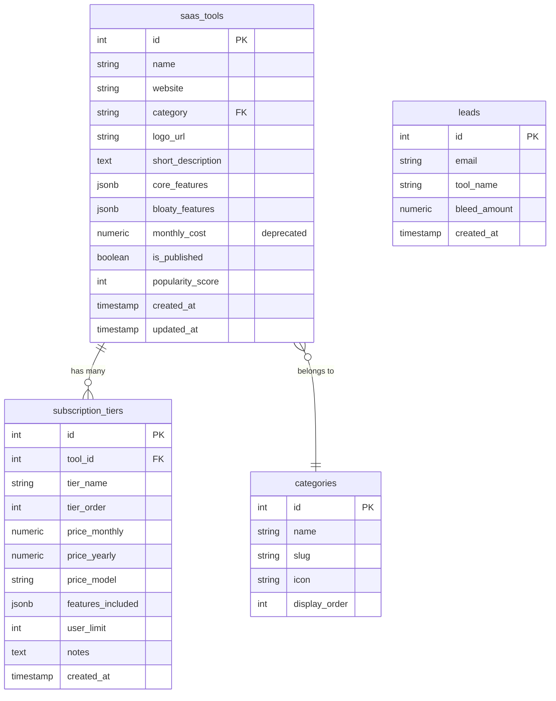

# ✨ Postable.com UI Redesign + Subscription Tier Management

## Overview

Transform SaaS Killer's UI to match Postable.com's aesthetic while implementing structured feature display (20 core + 10 bloaty per app), adding 100 pre-populated SaaS tools, and introducing subscription tier selection for accurate monthly spend calculations.

## Problem Statement / Motivation

**Current Limitations:**
- UI lacks polish and professional aesthetic
- No fixed feature structure (AI generates variable counts)
- Empty database requires users to search each time (no browse experience)
- Single monthly cost per tool (doesn't reflect tier variations)
- No way to adjust subscription level for team-specific calculations
- Limited utility for portfolio analysis

**User Pain Points:**
- Can't quickly browse popular SaaS tools
- No clear distinction between essential vs. bloat features
- Cost calculations don't match real-world subscription choices
- No ability to model "what if I downgrade to Basic tier?"

**Business Impact:**
- Low discoverability (users must know tool name to search)
- Inaccurate cost estimates reduce credibility
- Generic UI reduces perceived quality
- Limited data set reduces utility

## Proposed Solution

### High-Level Changes

**1. UI Redesign (Postable.com Aesthetic)**
- Adopt Postable color palette: Turquoise (#8AE5DD), Coral Red (#FF5132), Navy Blue (#00265D), Cream (#FFFEFA)
- Generous whitespace and clean typography
- Card-based layouts with hover effects
- Warm, friendly, benefit-focused tone

**2. Structured Feature Display**
- Enforce exactly 20 core features per app (essential for 80%+ of users)
- Enforce exactly 10 bloaty features per app (rarely used by 80%+ of users)
- Clear visual separation with badges and sections
- Feature descriptions in tooltips

**3. Pre-Populated Database**
- 100 top SaaS tools seeded on deployment
- Based on G2/Capterra rankings (CRM, Marketing, DevOps, Analytics, etc.)
- Browse-able directory with categories and search
- Each tool complete with 30 features and pricing tiers

**4. Subscription Tier System**
- Multiple pricing tiers per app (Free, Basic, Pro, Enterprise)
- User-editable tier selector dropdown
- Real-time cost recalculation based on tier + team size
- Tier comparison view showing differences

**5. Enhanced Cost Calculator**
- Monthly cost per tier per user
- Team size input (default: 5 users)
- Annual vs. monthly toggle
- Total portfolio cost if multiple apps selected

## Technical Approach

### Architecture Changes

#### Database Schema Extensions

**New Table: `subscription_tiers`**
```sql
CREATE TABLE subscription_tiers (
  id SERIAL PRIMARY KEY,
  tool_id INTEGER REFERENCES saas_tools(id) ON DELETE CASCADE,
  tier_name VARCHAR(100) NOT NULL,
  tier_order INTEGER NOT NULL DEFAULT 0,
  price_monthly NUMERIC(10,2),
  price_yearly NUMERIC(10,2),
  price_model VARCHAR(50) DEFAULT 'per_seat', -- 'per_seat', 'flat', 'usage_based', 'custom'
  features_included JSONB DEFAULT '[]'::jsonb,
  user_limit INTEGER,
  notes TEXT,
  created_at TIMESTAMP DEFAULT CURRENT_TIMESTAMP
);

CREATE INDEX idx_subscription_tiers_tool_id ON subscription_tiers(tool_id);
CREATE INDEX idx_subscription_tiers_tier_order ON subscription_tiers(tier_order);
```

**Updated Table: `saas_tools`**
```sql
-- Add columns to existing saas_tools table
ALTER TABLE saas_tools
  ADD COLUMN category VARCHAR(100),
  ADD COLUMN logo_url VARCHAR(500),
  ADD COLUMN short_description TEXT,
  ADD COLUMN website VARCHAR(500),
  ADD COLUMN is_published BOOLEAN DEFAULT false,
  ADD COLUMN popularity_score INTEGER DEFAULT 0,
  ADD CONSTRAINT chk_core_features_count CHECK (jsonb_array_length(core_features) <= 20),
  ADD CONSTRAINT chk_bloaty_features_count CHECK (jsonb_array_length(bloaty_features) <= 10);

-- Rename features column for clarity
ALTER TABLE saas_tools
  RENAME COLUMN features TO core_features;

-- Add new bloaty_features column
ALTER TABLE saas_tools
  ADD COLUMN bloaty_features JSONB DEFAULT '[]'::jsonb;

-- Update feature structure
-- core_features: [{"id": 1, "name": "User Management", "description": "Full CRUD for users", "icon": "users"}]
-- bloaty_features: [{"id": 1, "name": "Advanced Analytics", "description": "Rarely used reports"}]
```

**Categories Reference Data**
```sql
CREATE TABLE categories (
  id SERIAL PRIMARY KEY,
  name VARCHAR(100) UNIQUE NOT NULL,
  slug VARCHAR(100) UNIQUE NOT NULL,
  icon VARCHAR(50),
  display_order INTEGER DEFAULT 0
);

INSERT INTO categories (name, slug, icon, display_order) VALUES
  ('Communication', 'communication', 'message-circle', 1),
  ('Productivity', 'productivity', 'check-square', 2),
  ('Development', 'development', 'code', 3),
  ('Design', 'design', 'palette', 4),
  ('Marketing', 'marketing', 'megaphone', 5),
  ('Sales & CRM', 'sales-crm', 'users', 6),
  ('Analytics', 'analytics', 'bar-chart', 7),
  ('Project Management', 'project-management', 'trello', 8),
  ('Finance', 'finance', 'dollar-sign', 9),
  ('HR & Recruiting', 'hr-recruiting', 'briefcase', 10);
```

#### API Endpoints

**New Endpoints:**
```javascript
// GET /api/saas-tools - List all tools with pagination & filters
// Query params: ?page=1&limit=20&category=communication&search=slack

// GET /api/saas-tools/:id - Get single tool with tiers
// Returns: { tool: {...}, subscription_tiers: [...] }

// GET /api/saas-tools/:id/tiers - Get subscription tiers for a tool

// POST /api/calculate-cost - Calculate monthly/yearly cost
// Body: { tool_id, tier_id, team_size, billing_period: 'monthly'|'yearly' }
// Returns: { monthly_cost, yearly_cost, savings_percent }

// GET /api/categories - List all categories

// POST /api/saas-tools/bulk - Bulk seed tools (admin only)
```

**Update Existing:**
```javascript
// POST /api/tools/search - Keep for backward compatibility
// Update to return tools with tiers embedded
```

#### Frontend State Management (Zustand)

**New Store: `useSaasToolsStore`**
```javascript
// File: src/stores/saasToolsStore.js

export const useSaasToolsStore = create(persist((set, get) => ({
  // State
  tools: [],
  categories: [],
  selectedTool: null,
  selectedTiers: new Map(), // Map<toolId, tierId>
  teamSize: 5,
  billingPeriod: 'monthly',
  filters: {
    category: null,
    search: '',
    priceRange: [0, 1000]
  },

  // Actions
  setTools: (tools) => set({ tools }),
  setSelectedTool: (tool) => set({ selectedTool: tool }),

  selectTier: (toolId, tierId) => set((state) => {
    const newMap = new Map(state.selectedTiers);
    newMap.set(toolId, tierId);
    return { selectedTiers: newMap };
  }),

  setTeamSize: (size) => set({ teamSize: Math.max(1, size) }),
  setBillingPeriod: (period) => set({ billingPeriod: period }),

  // Computed
  getTotalMonthlyCost: () => {
    const { tools, selectedTiers, teamSize, billingPeriod } = get();
    let total = 0;

    for (const [toolId, tierId] of selectedTiers.entries()) {
      const tool = tools.find(t => t.id === toolId);
      if (!tool) continue;

      const tier = tool.subscription_tiers?.find(t => t.id === tierId);
      if (!tier) continue;

      const price = billingPeriod === 'monthly'
        ? tier.price_monthly
        : tier.price_yearly / 12;

      const multiplier = tier.price_model === 'per_seat' ? teamSize : 1;
      total += price * multiplier;
    }

    return total;
  }
})));
```

### Component Architecture

#### New Components

**1. `ToolBrowser.jsx`**
- Grid/list view of 100 SaaS tools
- Category tabs/filters
- Search bar
- Card hover effects (Postable style)

**2. `ToolDetailView.jsx`**
- Main tool information
- 20 Core Features section
- 10 Bloaty Features section
- Subscription tier selector
- Cost calculator sidebar

**3. `FeatureList.jsx`**
- Renders core features with green badges
- Renders bloaty features with red "BLOAT" badges
- Tooltip descriptions on hover
- Icons per feature type

**4. `TierSelector.jsx`**
- Dropdown or card-based tier selection
- Real-time cost preview
- Tier comparison tooltip
- "Contact Sales" handling

**5. `CostCalculator.jsx`**
- Team size slider/input
- Monthly vs. yearly toggle
- Per-user breakdown display
- 3-year TCO calculation

**6. `CategoryFilter.jsx`**
- Category chips/pills
- Active state styling
- Icon + name display

#### Updated Components

**`App.jsx`** - Add routing for browse vs. tool detail views
**`ToolSearch.jsx`** - Update to integrate with pre-populated directory
**Tailwind Config** - Extend with Postable color palette

### Data Population Strategy

#### Phase 1: Tool Selection (Manual, 2-4 hours)
Create `data/top-100-saas-tools.json`:
```json
[
  {
    "name": "Slack",
    "website": "https://slack.com",
    "category": "communication",
    "logo_url": "https://logo.clearbit.com/slack.com",
    "short_description": "Team messaging and collaboration platform"
  },
  // ... 99 more
]
```

**Sources:**
- G2 Grid Reports (Top SaaS by category)
- Capterra Best Software Awards
- Stack Overflow Developer Survey
- Manual curation for balance across categories

#### Phase 2: Feature Curation (Semi-Automated, 20-40 hours)

**For each of 100 tools:**
1. Use Perplexity API to analyze tool and suggest 30 features
2. Manual review to enforce 20 core + 10 bloat limit
3. Write descriptions (50-100 characters each)
4. Tag with icons (from Lucide React)

**Feature Curation Script:**
```javascript
// File: scripts/curate-features.js
// Prompts Perplexity with enhanced instructions:
// "Analyze [Tool Name] and identify exactly:
//  - 20 CORE features (used by 80%+ of customers daily/weekly)
//  - 10 BLOAT features (advanced features rarely used by 80%+ of customers)
//  For each feature, provide: name (max 30 chars), description (max 100 chars), icon suggestion"
```

#### Phase 3: Pricing Research (Manual, 10-20 hours)

**For each tool, document 2-5 tiers:**
- Tier name (e.g., "Free", "Pro", "Enterprise")
- Monthly price per user (or flat)
- Annual price (if discount available)
- User/storage limits
- Feature availability per tier

**Data Collection Spreadsheet:**
| Tool | Tier Name | Monthly | Yearly | Price Model | User Limit | Notes |
|------|-----------|---------|--------|-------------|------------|-------|
| Slack | Free | $0 | $0 | per_seat | Unlimited | Limited history |
| Slack | Pro | $7.25 | $87 | per_seat | Unlimited | Full features |
| Slack | Business+ | $12.50 | $150 | per_seat | Unlimited | Advanced admin |

#### Phase 4: Database Seeding (Automated, 1 hour)

**Seed Script:**
```javascript
// File: api/seeds/001_seed_saas_tools.js
// Reads JSON files and bulk inserts into PostgreSQL
// Handles: tools → tiers → features
// Validates: feature counts, tier pricing logic
// Outputs: Success/error report
```

**Run Command:**
```bash
node api/seeds/001_seed_saas_tools.js
```

### UI/UX Implementation

#### Design System Updates

**Tailwind Config Extensions:**
```javascript
// File: tailwind.config.js
colors: {
  // Existing SaaS Killer colors (keep for compatibility)
  'brand-primary': '#E8D619',
  'brand-secondary': '#1EA897',
  'brand-accent': '#FF4A3A',

  // New Postable-inspired palette
  'postable-turquoise': '#8AE5DD',
  'postable-coral': '#FF5132',
  'postable-navy': '#00265D',
  'postable-cream': '#FFFEFA',

  // Semantic colors
  'feature-core': '#10b981', // green-500
  'feature-bloat': '#ef4444', // red-500
},
spacing: {
  '18': '4.5rem',
  '22': '5.5rem',
},
boxShadow: {
  'card': '0 1px 3px rgba(0, 0, 0, 0.1)',
  'card-hover': '0 10px 25px rgba(0, 0, 0, 0.15)',
}
```

**Typography:**
- Headings: DM Sans Bold (already configured)
- Body: Inter Regular
- Line height: 1.6 (generous)
- Letter spacing: Normal to slightly loose

**Layout Principles:**
- Max width containers: 1200px
- Grid: 12-column on desktop, 4-column on tablet, 1-column on mobile
- Padding: 8-12rem (32-48px) vertical sections
- Card spacing: 6 (24px) gap

#### Responsive Breakpoints

- **Mobile:** 320px - 640px (1 column, stacked features)
- **Tablet:** 641px - 1024px (2 column grid)
- **Desktop:** 1025px+ (3-4 column grid, sidebar layouts)

**Mobile-Specific Adjustments:**
- Tier selector: Full-width dropdown (no cards)
- Feature list: Collapsible sections
- Cost calculator: Sticky bottom bar
- Tool grid: 1 column cards

#### Loading & Empty States

**Tool Browser Loading:**
```jsx
<div className="grid grid-cols-1 md:grid-cols-2 lg:grid-cols-3 gap-6">
  {[...Array(9)].map((_, i) => (
    <div key={i} className="animate-pulse">
      <div className="h-48 bg-gray-200 rounded-lg"></div>
    </div>
  ))}
</div>
```

**Empty Search Results:**
```jsx
<div className="text-center py-12">
  <SearchX className="w-16 h-16 text-gray-400 mx-auto mb-4" />
  <h3 className="text-xl font-semibold text-gray-700">No tools found</h3>
  <p className="text-gray-500">Try adjusting your filters or search term</p>
</div>
```

**Error State (API Failure):**
```jsx
<div className="bg-red-50 border border-red-200 rounded-lg p-6">
  <AlertCircle className="w-8 h-8 text-red-500 mb-2" />
  <h3 className="font-semibold text-red-900">Failed to load tools</h3>
  <p className="text-red-700 text-sm">Please try again later.</p>
  <button onClick={retry} className="mt-4 px-4 py-2 bg-red-500 text-white rounded">
    Retry
  </button>
</div>
```

## Acceptance Criteria

### Functional Requirements

- [ ] **FR1**: User can browse 100 pre-populated SaaS tools in a grid/list view
- [ ] **FR2**: Each tool displays exactly 20 core features and 10 bloaty features
- [ ] **FR3**: Core features are visually distinct (green badge/section) from bloaty features (red badge)
- [ ] **FR4**: User can filter tools by category (10 categories)
- [ ] **FR5**: User can search tools by name or keyword
- [ ] **FR6**: Each tool displays 2-5 subscription tiers with pricing
- [ ] **FR7**: User can select a subscription tier from a dropdown/card selector
- [ ] **FR8**: Changing tier updates monthly cost calculation in real-time
- [ ] **FR9**: User can adjust team size (1-100 users) via input/slider
- [ ] **FR10**: Cost calculator shows per-user breakdown for per-seat pricing
- [ ] **FR11**: Cost calculator displays both monthly and yearly totals
- [ ] **FR12**: UI matches Postable.com aesthetic (colors, spacing, typography)
- [ ] **FR13**: All 100 tools have complete data (30 features + tiers + pricing)
- [ ] **FR14**: Tool selection persists in localStorage (or user account if auth added)
- [ ] **FR15**: Mobile responsive layout works on screens 320px+

### Non-Functional Requirements

- [ ] **NFR1**: Tool browser page loads in < 2 seconds
- [ ] **NFR2**: Tier selection triggers cost recalculation in < 100ms
- [ ] **NFR3**: Search results appear within 300ms of typing
- [ ] **NFR4**: Database queries use proper indexes (no table scans)
- [ ] **NFR5**: All feature counts validated at database level (constraints)
- [ ] **NFR6**: Responsive design tested on Chrome, Firefox, Safari, Mobile Safari, Chrome Mobile
- [ ] **NFR7**: Lighthouse performance score > 85
- [ ] **NFR8**: Accessibility: WCAG 2.1 AA compliance (keyboard nav, ARIA labels, contrast ratios)

### Quality Gates

- [ ] **QG1**: Code review approval (focus on database schema, cost calculation logic)
- [ ] **QG2**: Manual QA of all 100 tools for data accuracy
- [ ] **QG3**: Cross-browser testing checklist completed
- [ ] **QG4**: Mobile device testing (iOS + Android) completed
- [ ] **QG5**: Performance profiling completed (no React render loops, optimized queries)
- [ ] **QG6**: Pricing data validated against vendor websites (spot check 20 tools)

## Success Metrics

**Quantitative:**
- 100 SaaS tools successfully seeded with 30 features each
- All tools have 2-5 subscription tiers with pricing
- Page load time < 2 seconds (measured via Lighthouse)
- Zero database constraint violations (feature count limits enforced)

**Qualitative:**
- User can find and compare tools without searching external sites
- Cost calculations feel accurate and trustworthy
- UI feels professional and polished (Postable-like aesthetic achieved)
- Feature categorization (core vs. bloat) is intuitive

**User Behavior (Post-Launch):**
- Average session time increases (browsing vs. one-time search)
- Tier selection interaction rate > 30% of tool views
- Search-to-detail view conversion > 60%
- Return visit rate increases (data persistence value)

## Dependencies & Risks

### Dependencies

**Internal:**
- PostgreSQL database available with `pg` npm package
- Express.js API server running on port 3000/3001
- React frontend with Zustand state management
- Tailwind CSS configured
- Perplexity API key for feature curation (during seeding only)

**External:**
- G2/Capterra for SaaS tool rankings (manual research)
- Vendor websites for accurate pricing data
- Clearbit logo API for tool logos (or manual upload)
- (Optional) Figma design mockup from designer

### Risks & Mitigation

| Risk | Likelihood | Impact | Mitigation |
|------|------------|--------|------------|
| **Feature curation takes 40+ hours** | High | High | Start with 25 high-priority tools; launch MVP, add 75 progressively |
| **Pricing data becomes outdated** | High | Medium | Add "Last Updated" timestamps; quarterly manual review process |
| **20/10 feature limit too restrictive** | Medium | Medium | Allow tier-locked features to count separately; revisit after user feedback |
| **Tier selection UX unclear** | Medium | High | Create interactive Figma prototype first; user test with 5 people |
| **Database migration breaks existing data** | Low | High | Backup database; test migration on staging; rollback plan ready |
| **Mobile layout cramped (30 features)** | Medium | Medium | Use collapsible sections; prioritize core features visible by default |
| **Cost calculation doesn't handle edge cases** | Medium | High | Document assumptions (e.g., "Contact Sales" shows as custom); unit test thoroughly |
| **Postable aesthetic subjective/inconsistent** | Medium | Low | Create design system component library first; get stakeholder approval |

## Implementation Plan

### Phase 1: Foundation (Database & API)
**Estimated Effort:** 3-5 days

**Tasks:**
- [ ] Create database migration: `subscription_tiers` table
- [ ] Create database migration: Update `saas_tools` schema (add columns, constraints)
- [ ] Create database migration: `categories` reference data
- [ ] Build API endpoint: `GET /api/saas-tools` (list with pagination)
- [ ] Build API endpoint: `GET /api/saas-tools/:id` (detail with tiers)
- [ ] Build API endpoint: `POST /api/calculate-cost`
- [ ] Build API endpoint: `GET /api/categories`
- [ ] Write unit tests for cost calculation logic
- [ ] Create seed script structure: `seeds/001_seed_saas_tools.js`

**Validation:**
- Run migrations on local dev database
- Test API endpoints with Postman/curl
- Verify constraints work (try inserting 21 core features → should fail)

### Phase 2: Data Population
**Estimated Effort:** 20-40 hours (manual + scripted)

**Tasks:**
- [ ] Research and document 100 SaaS tools list (JSON file)
- [ ] For top 25 priority tools:
  - [ ] Use Perplexity API to generate 30 features per tool
  - [ ] Manually review and refine to exactly 20 core + 10 bloat
  - [ ] Write descriptions for each feature
  - [ ] Research and document 2-5 subscription tiers per tool
  - [ ] Collect pricing data (monthly/yearly per tier)
- [ ] Run seed script to populate database
- [ ] Manual QA: Spot check 10 tools for data accuracy
- [ ] (Optional) Add remaining 75 tools post-MVP launch

**Validation:**
- Query database: `SELECT COUNT(*) FROM saas_tools WHERE is_published = true;` → Should be 25-100
- Verify each tool has 20 core + 10 bloat features
- Verify each tool has 2+ subscription tiers

### Phase 3: Frontend State & Routing
**Estimated Effort:** 2-3 days

**Tasks:**
- [ ] Create `useSaasToolsStore` Zustand store
- [ ] Implement state actions: `setTools`, `selectTier`, `setTeamSize`
- [ ] Implement computed values: `getTotalMonthlyCost`
- [ ] Add localStorage persistence for selected tiers
- [ ] Set up React Router (if not already): `/browse`, `/tools/:id`
- [ ] Create API service layer: `src/services/saasToolsApi.js`
- [ ] Handle loading/error states in store

**Validation:**
- Test state updates in React DevTools
- Verify localStorage persistence (reload page, state restored)
- Test API integration (fetch tools, select tier, cost updates)

### Phase 4: UI Components (Core)
**Estimated Effort:** 4-6 days

**Tasks:**
- [ ] Update Tailwind config with Postable colors
- [ ] Create `ToolBrowser.jsx` component (grid view)
- [ ] Create `ToolCard.jsx` component (card in grid)
- [ ] Create `CategoryFilter.jsx` component
- [ ] Create `SearchBar.jsx` component
- [ ] Create `ToolDetailView.jsx` component (layout shell)
- [ ] Create `FeatureList.jsx` component (20 core + 10 bloat)
- [ ] Create `TierSelector.jsx` component (dropdown)
- [ ] Create `CostCalculator.jsx` component (sidebar)
- [ ] Create loading skeleton components
- [ ] Create error state components

**Validation:**
- Visual QA: Compare to Postable.com for aesthetic match
- Responsive testing: 320px, 768px, 1024px, 1440px viewports
- Accessibility audit: keyboard navigation, screen reader

### Phase 5: Polish & Optimization
**Estimated Effort:** 2-3 days

**Tasks:**
- [ ] Add hover animations (card lift, button transitions)
- [ ] Implement smooth scrolling and transitions
- [ ] Add feature icons (Lucide React)
- [ ] Optimize images (compress logos, use WebP)
- [ ] Add meta tags for SEO
- [ ] Run Lighthouse audit, fix issues
- [ ] Cross-browser testing (Chrome, Firefox, Safari, Edge)
- [ ] Mobile device testing (iOS Safari, Chrome Mobile)
- [ ] Fix any layout bugs or edge cases
- [ ] Add "Last Updated" timestamps to tool data

**Validation:**
- Lighthouse score > 85 (Performance, Accessibility, Best Practices)
- No console errors or warnings
- All 100 tools browsable and functional

### Phase 6: Documentation & Deployment
**Estimated Effort:** 1 day

**Tasks:**
- [ ] Update README with new features
- [ ] Document database schema (ERD diagram)
- [ ] Document API endpoints (OpenAPI/Swagger or markdown)
- [ ] Create admin guide for updating pricing data
- [ ] Write deployment checklist
- [ ] Test database backup/restore procedure
- [ ] Deploy to staging environment
- [ ] Smoke test on staging
- [ ] Deploy to production
- [ ] Monitor error logs for 24 hours

**Validation:**
- Staging and production environments match local dev
- No deployment errors
- Database migrations applied successfully

## Database ERD



## File Structure Changes

```
saaskiller/
├── api/
│   ├── migrations/
│   │   ├── 001_create_subscription_tiers.sql
│   │   ├── 002_update_saas_tools_schema.sql
│   │   └── 003_create_categories.sql
│   ├── seeds/
│   │   ├── 001_seed_saas_tools.js
│   │   └── data/
│   │       ├── top-100-saas-tools.json
│   │       ├── features/
│   │       │   ├── slack.json
│   │       │   └── ... (100 files)
│   │       └── tiers/
│   │           ├── slack.json
│   │           └── ... (100 files)
│   └── server.js (updated with new endpoints)
├── src/
│   ├── components/
│   │   ├── ToolBrowser.jsx (NEW)
│   │   ├── ToolCard.jsx (NEW)
│   │   ├── ToolDetailView.jsx (NEW)
│   │   ├── FeatureList.jsx (NEW)
│   │   ├── TierSelector.jsx (NEW)
│   │   ├── CostCalculator.jsx (NEW)
│   │   ├── CategoryFilter.jsx (NEW)
│   │   ├── SearchBar.jsx (NEW)
│   │   └── ui/
│   │       ├── Badge.jsx (NEW)
│   │       ├── Card.jsx (NEW)
│   │       └── Skeleton.jsx (NEW)
│   ├── stores/
│   │   └── saasToolsStore.js (NEW)
│   ├── services/
│   │   └── saasToolsApi.js (NEW)
│   └── App.jsx (updated routing)
├── scripts/
│   └── curate-features.js (NEW - Perplexity helper)
├── documentation/
│   ├── api-endpoints.md (NEW)
│   └── database-schema.md (NEW)
└── tailwind.config.js (updated colors)
```

## References & Research

### Internal References
- Current database schema: `/home/tim/Desktop/saaskiller/api/server.js:30-57`
- Current state management: `/home/tim/Desktop/saaskiller/src/store/auditStore.js`
- Current API service: `/home/tim/Desktop/saaskiller/src/services/api.js`
- Design system tokens: `/home/tim/Desktop/saaskiller/tailwind.config.js`
- Postable style guide: `/home/tim/Desktop/saaskiller/documentation/postable/postable-styleguide.md`

### External References
- **Postable.com Inspiration:** https://postable.com/ (color palette, spacing, card design)
- **G2 Top Software:** https://www.g2.com/categories (source for top 100 SaaS tools)
- **Lucide React Icons:** https://lucide.dev/ (feature icons)
- **Tailwind CSS Docs:** https://tailwindcss.com/docs (design system patterns)
- **React Router:** https://reactrouter.com/en/main (routing implementation)
- **Zustand Docs:** https://docs.pmnd.rs/zustand/getting-started/introduction (state management)

### Best Practices Applied
- **Database Constraints:** Enforce 20/10 feature limits at schema level
- **Separation of Concerns:** API layer handles business logic, frontend handles presentation
- **Progressive Enhancement:** Mobile-first responsive design, desktop enhancements
- **Accessibility:** Semantic HTML, ARIA labels, keyboard navigation, proper contrast ratios
- **Performance:** Lazy loading, optimized images, memoized calculations, indexed queries

### Research Findings from SpecFlow Analysis
- 8 critical gaps identified (tier data model, cost calculation, feature limits)
- 17 important UX considerations (default tier, team size input, mobile layout)
- Key insight: Need clear default tier selection logic (recommend: cheapest paid tier)
- Key insight: Team size significantly affects cost (default to 5 users, allow 1-100)
- Key insight: Feature count enforcement must be database-level constraint

---

## Questions for Clarification

**Before Implementation Starts:**
1. **Tier Data Model:** Confirm 4 standard tiers (Free/Basic/Pro/Enterprise) or variable per app?
2. **Cost Formula:** Is it always `tier.price_monthly × team_size` or more complex?
3. **Default Tier:** Which tier should be selected by default? (Recommend: cheapest paid tier)
4. **100 Tools Deadline:** Must all 100 be complete for launch, or can we launch with 25 and add progressively?
5. **User Authentication:** Is this anonymous (localStorage) or will we add user accounts later?

**Design Approval Needed:**
- Figma mockup of tool detail page (features + tier selector + cost calculator)
- Mobile responsive layout wireframe
- Postable color palette confirmation

**Post-MVP Considerations:**
- Portfolio view (multi-app total cost aggregation)
- Saved scenarios ("My Agency Stack", "My Enterprise Stack")
- Export to PDF/CSV
- Pricing update automation (web scraping?)
